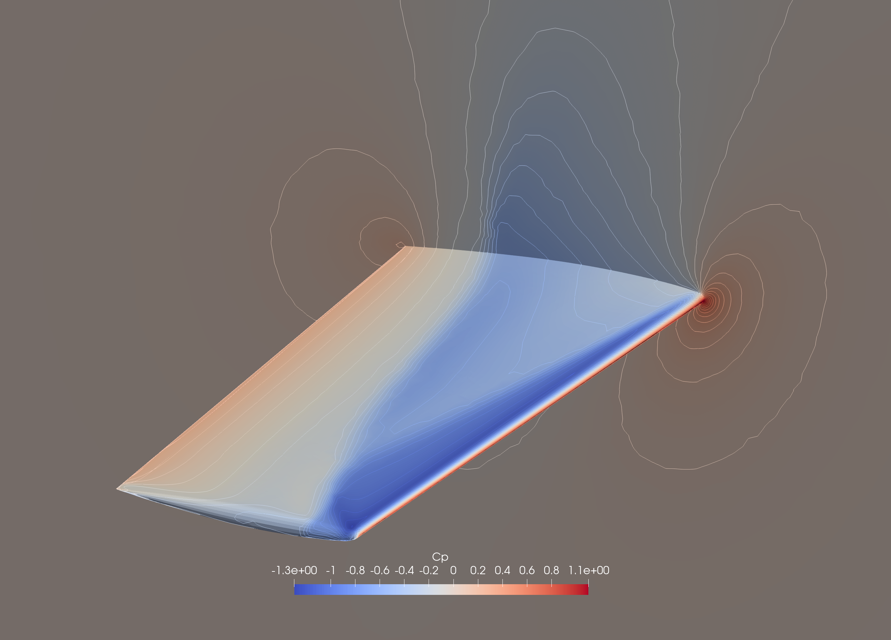

**********
Examples
**********

Three-dimensional explosion problem
===================================
This example is an extension of the shock-tube problem to a three-dimensional sphere. The details of the flow configuration can be found in `this paper <https://doi.org/10.1016/j.compfluid.2012.04.015>`_. 
The initial condition corresponds to a spherical extension of the Sod shock-tube
problem, where the diaphragm is defined by a sphere of radius
:math:`r_0 = 0.4`.

The left and right states are given by

.. math::
   (\rho, p) =
   \begin{cases}
   (1.0,\; 1.0), & r < r_0, \\
   (0.125,\; 0.1), & r > r_0,
   \end{cases}

with zero initial velocity everywhere. The procedures to obtain an unsteady solution are presented as follows:

1. Convert mesh::

    user@Computer ~/pyBaram$ pybaram import explosion.cgns explosion.pbrm

2. Partition the mesh::

    user@Computer ~/pyBaram$ pybaram partition <ranks> explosion.pbrm explosion_p.pbrm

3. Run the parallel simulation::

    user@Computer ~/pyBaram$ mpirun -n <ranks> pybaram run explosion_p.pbrm explosion.ini

4. Convert the solution to a VTK file for visualization::

    user@Computer ~/pyBaram$ pybaram export explosion_p.pbrm out-0.25.pbrs out.vtu

5. After visualizing the solution in ParaView, you should obtain the following result.

.. figure:: ./figs/explosion/Density_contour.png
   :width: 200px
   :figwidth: 200px
   :alt: explosion
   :align: center

   Density contour of explosion problem

Transonic flow over RAE2822 airfoil
===================================
This example considers transonic flow over the RAE2822 airfoil, which is a well-known benchmark case. The flow conditions correspond to the NPARC RAE2822 Case 4 test case, with detailed specifications available from the `NPARC validation page <https://www.grc.nasa.gov/www/wind/valid/raetaf/raetaf.html>`_.
The computational mesh is obtained from the `SU2 tutorial page <https://su2code.github.io/tutorials/Turbulent_2D_Constrained_RAE2822/>`_.

The free-stream conditions are defined as

.. math::
   M_\infty = 0.729, \qquad
   Re_c = 6.5 \times 10^6, \qquad
   \alpha = 2.31^\circ,

where the Reynolds number is based on the chord length :math:`c`. The free-stream temperature is

.. math::
   T_\infty = 255.556~\mathrm{K}.

A fully turbulent RANS simulation is performed under transonic conditions. The procedures to obtain a steady-state solution are presented as follows:

1. Convert mesh::

    user@Computer ~/pyBaram$ pybaram import rae2822.cgns rae2822.pbrm

2. Running simulations::

    user@Computer ~/pyBaram$ pybaram run rae2822.pbrm rae2822.ini

3. Convert the solution to a VTK file for visualization::

    user@Computer ~/pyBaram$ pybaram export rae2822.pbrm out-10000.pbrs out.vtu

4. After visualizing the solution in ParaView, you should obtain the following result.

.. figure:: ./figs/rae2822/Mach_contour.png
   :width: 450px
   :figwidth: 450px
   :alt: rae2822
   :align: center

   Mach contour of flow over RAE2822 airfoil

Transonic flow over ONERA M6 wing
=================================
This example considers transonic flow over the ONERA M6 wing, which is a standard benchmark for three-dimensional transonic flow simulations. The flow conditions follow the ONERA M6 test case documented in the `NASA Turbulence Modeling Resource <https://turbmodels.larc.nasa.gov/onerawingnumerics_val.html>`_.

The free-stream conditions are defined as

.. math::
   M_\infty = 0.84, \qquad
   Re_{c,\mathrm{root}} = 14.6 \times 10^6, \qquad
   \alpha = 3.06^\circ,

where the Reynolds number is based on the root chord length.
The free-stream temperature is

.. math::
   T_\infty = 300~\mathrm{K}.

A fully turbulent RANS simulation is performed under transonic conditions. The procedures to obtain a steady-state solution are presented as follows:

1. Convert mesh::

    user@Computer ~/pyBaram$ pybaram import oneram6.cgns oneram6.pbrm

2. Partition the mesh::

    user@Computer ~/pyBaram$ pybaram partition <ranks> oneram6.pbrm oneram6_p.pbrm

3. Run the parallel simulation::

    user@Computer ~/pyBaram$ mpirun -n <ranks> pybaram run oneram6_p.pbrm oneram6.ini

4. Convert the solution to a VTK file for visualization::

    user@Computer ~/pyBaram$ pybaram export oneram6_p.pbrm out-3000.pbrs out.vtu

5. After visualizing the solution in ParaView, you should obtain the following result.

   Pressure contour of ONERA M6 wing surface

Supersonic flow over HB-2 model
================================
The HB-2 model is a standard test case for an axisymmetric body. Detailed flow conditions and
experimental data are available in the
`AEDC technical report <https://apps.dtic.mil/sti/pdfs/AD0412651.pdf>`_.

The free-stream conditions are defined as

.. math::
   M_\infty = 2.0, \qquad
   Re_D = 1.7 \times 10^6, \qquad
   \alpha = 0^\circ,

where the Reynolds number is based on the body diameter :math:`D`.

A fully turbulent RANS simulation is performed under supersonic conditions. The procedures to obtain a steady-state solution are presented as follows:

1. Convert mesh::

    user@Computer ~/pyBaram$ pybaram import hb2.cgns hb2.pbrm

2. Partition the mesh::

    user@Computer ~/pyBaram$ pybaram partition <ranks> hb2.pbrm hb2_p.pbrm

3. Run the parallel simulation::

    user@Computer ~/pyBaram$ mpirun -n <ranks> pybaram run hb2_p.pbrm hb2.ini

4. Convert the solution to a VTK file for visualization::

    user@Computer ~/pyBaram$ pybaram export hb2_p.pbrm out-5000.pbrs out.vtu

5. After visualizing the solution in ParaView, you should obtain the following result.

.. figure:: ./figs/hb2/hb2_mach_m2.png
   :width: 450px
   :figwidth: 450px
   :alt: hb2
   :align: center

   Mach contour around HB-2 model at :math:`M=2.0`.